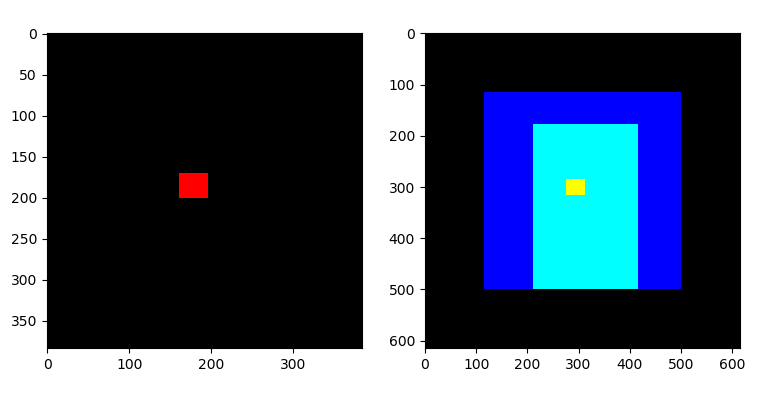
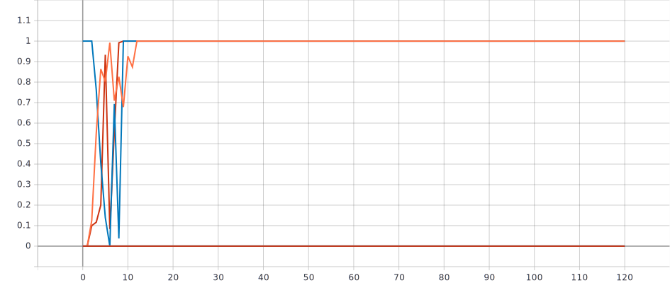
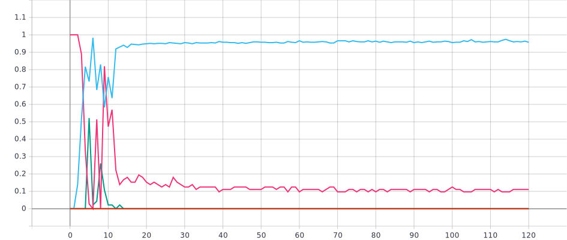
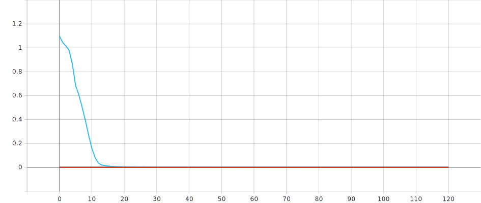
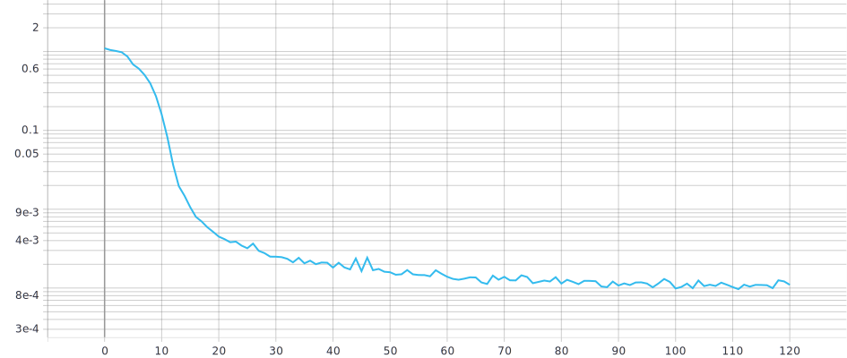

# :pencil2:2019.5.12 周六会议记录
1. 调大后两类样本的class weight，尝试设置到极端情况，如原来的1k倍、10k倍等情况； 
2. 用交叉验证，5-fold；
3. 肠壁标记，具体操作待定；  
4. 加上数据增广，几种方式都加上（trans，crop，flip，scaling，rota）；
5. 以肿瘤为中心进行box切割，具体操作待定；  
6. 保存数据增广后的图片，再读取；spacing后，切割出肿瘤box，再resize到250（>224），再切割5个点（4个角和中心）224大小，再flip，就有10个样本。
7. 用于normalize的mean和std取自于每个病人，也可以尝试用每个slide的mean和std；
8. 350 x 350 或350 x 250；  
9. 把病变区域tumor也加入到输入作为输入的一部分，具体操作待定。

## 2019.5.10
> add by peng

1. 将load_dataset_v3改名为laod_dataset；
2. models库添加模型alexnet、densenet、inception、mobilenet、resnet、squeezenet、vggnet；
3. 尝试用pre-trained模型进行训练；

# :pencil2:2019.5.11

**初始化数据集，统计所需数据**

> 所有的取整操作，都使用 `round`

- 按病人随机划分训练集和测试集，其中测试集约占 20%，除去没有肿瘤区域的 slides
- 统计均值、标准差。遍历数据集，得到
  - 训练集的均值和方差
  - 测试集的均值和方差

------

- 记录每张图片的大小 (shape)，记为 `shape` (512 * 512)
- 记录每张图片的 spacing，以及整个数据集 spacing 字段的众数，作为标准 spacing (其他图片都将 resize 到这个 spacing)，记为 `global_std_spacing_mode`
- 计算每张图片 resize 到标准 spacing 后的大小 (shape)，并记为 `shape_spc`，并记录 spacing 之后图片大小的最大值，即 `shape_spc` 的最大值，记为 `max_size_spc` (615)

------

- 记录每张图片的肿瘤区域
- 记录每张图片 spacing 之后的肿瘤区域

<table>
    <tr>
        <td>

</td>
    </tr>
</table>

左图，是 spacing 之后的一张最小的图片 (最小的大小是 384 * 384)，红色区域是它的肿瘤区域

右图，是 spacing 之后的最大的图片，615 * 615

进行坐标变换，将左图放到右图中，那左图就放在了右图的蓝色正方形处，而黄色区域是肿瘤区域

对所有图片都做这样的坐标变换，放大最大图的中心

现在，找出整个数据集中，包含所有图片肿瘤区域的边框 (右图的青色区域)，青色区域在最小图区域里

**数据预处理步骤**

1. 通过 `SimpleITK` 读取图片，数据类型 `numpy int16`，数据格式 `(h, w, c)`
2. 将 `numpy` 类型的图片转为 `PIL.Image` ，数据类型 `PIL.Image.Image image mode=I;16`，数据格式 `(h, w, c)`
3. 如果图片的原始大小 (`shape`) 和 resize 到标准 spacing 后的大小 (`shape_spc`) 不相等，那么将图片 resize 到标准 spacing，即 resize 到 `shape_spc`
4. 如果图片 spacing 之后的大小不是最大的，即 `shape_spc != max_size_spc`，那么将它 `CenterCrop` 到最大的图片大小 (这时图片放在中心，周围有一圈黑边)
5. 包含所有图片肿瘤区域的边框，是一个 h * w 长方形，h 是长边。最后切割出一个 h * h 的正方形区域，这个正方形的中心是长方形的中心。
6. 将图片 resize 到 244 * 244
7. 数据增广
   - `RandomRotation, degrees=[-10, 10]`
8. 转成 tensor，数据类型 `torch.int16`，数据格式 `(c, h, w)`
9. 类型转换，数据类型 `torch.float32`，数据格式 `(c, h, w)`
10. 归一化，训练集和测试集用各自的均值和标准差

**训练**

- loss function class weight = true
- weighted random sampler = false
- weight_decay = 0.0001
- lr = 0.001
- lr_decay_period = 30 (epoch)
- lr_decay_rate = 2

* 使用的模型

  * ResNet34, no pretrain
  * ResNet34, pretrain
  * ResNet152, pretrain
  * DenseNet121, pretrain

  

**结果**

尝试多个模型，无论有无预训练模型，多次训练，结果都是这样。训练集都到 100%，若使用预训练模型，几个 epoch 之后训练集就到 100%。

训练集混淆矩阵：

| truth/predict | 0    | 1    | 2    | Acc                   |
| ------------- | ---- | ---- | ---- | --------------------- |
| 0             | 1890 | 0    | 0    | 1890/1890 (100.0000%) |
| 1             | 0    | 269  | 0    | 269/269 (100.0000%)   |
| 2             | 0    | 0    | 138  | 138/138 (100.0000%)   |

测试集混淆矩阵：

| truth/predict | 0    | 1    | 2    | Acc                |
| ------------- | ---- | ---- | ---- | ------------------ |
| 0             | 463  | 57   | 3    | 463/523 (88.5277%) |
| 1             | 57   | 6    | 0    | 6/63 (9.5238%)     |
| 2             | 30   | 7    | 0    | 0/37 (0.0000%)     |

<table>
    <tr>
        <td>
train_class_acc
</td>
    </tr>
    <tr>
        <td>
train_class_acc
</td>
    </tr>
    <tr>
        <td>
train_loss
</td>
    </tr>
     <tr>
        <td>
train_loss_log
</td>
    </tr>
</table>

**TODO**

* 3D CNN

* 多模态

# :pencil: 2019.4.16 

## 1 注意事项

* 以病人为单位分 slides
* 合并数据集 1、2 (CC_ROI and 6_ROI)
* 考虑 2D CNN 的多通道输入（3通道）
* 对于死亡的病人，分别做：
  * 去掉其他（非肿瘤）死亡原因的病人
  * 不去掉

## 2 类别均衡

* 数据角度：

  在训练时实时做数据增广，用 pytorch 的函数

  不要先增广再训练。

* 算法角度：修改 loss function, 设置 class weight

## 3 Augmentation​

**训练前：**

尝试 pytorch 的其他 augmentation

对于每张图，先 rotate，再 crop，rotate 的角度在 之间，每15度 rotate 一次。

**注意：** 这不是为了解决类别均衡，只是增加了数据量

**测试时：** 分别对测试图片的原图、rotate 后、crop 后等处理的图片分别预测。然后用 voting 或 probability 的方法集成它们。

## 4 Cross Validation

K-fold validation

每一类分成 5 个 fold，交叉验证，看是否某一个 fold 效果差。

train : test = 8 : 2

**注意：** 按病人来分 fold，这里不需要保证每个 fold 的 slides 数量一样多

## 5 加入其他信息

其他信息有性别、年龄等，性别是二值的（0、1），年龄是多值的（0~100等），无法进行归一化，要考虑这个问题。

加其他医疗信息，在 ResNet 的 global average pooling 层与最后的 fc 层之间，加入一个 fc 层

# 📝 2019.4.4

## 1 模型选择

- 选择 ResNet 模型

- 考虑使用预训练的模型
- 优化器用 SGD

## 2 数据集预处理

### 2.1 样本筛选

对每个病人，去掉没有肿瘤标记的slide，只选取有肿瘤标记的slide作为数据样本。

考虑是否以某一阈值 P 作为每张slide筛选的条件，即对于某一张slide：

- 肿瘤标记的像素点数量n > P : 则作为数据样本;
- 肿瘤标记的像素点数量n <= P : 则去掉这张slide;

### 2.2 spacing与分辨率问题

**统计不同分辨率的图片分别有多少，不同spacing的图片分别有多少。**

统计每个病人每张slide的spacing，2D处理时只考虑xy方向，更具excel表中spacing的倒数这一属性，对每一张slide进行resize **（具体操作还不清楚，如何根据spacing进行resize）** 。

以小分辨率为基准进行resize，

### 2.3 切割

遍历所有图像后得到肿瘤的最大高度Hmax和宽度Wmax，得到一个切割box的高H和宽W（均略大于Hmax和Wmax，H=W），利用这个box对每张筛选后的slide进行切割，切割出只肿瘤附近的区域。

切割后再进行scale，因为经典ResNet的预训练模型等的输入为24×24。考虑如何裁剪。

pytorch有这一部分crop的函数。

### 2.4 正则化

pytorch的norm

均值：统计训练集（或是所有数据集）每一个样本每一个像素值求均值;

方差：同上求方差;

> 预处理的每一步操作后都将图片打印出来看一看。

## 3 训练集与测试集选择

- 方法1 (数据角度)：
  - 测试集与训练集的每种类别的样本数的之间的比例相同，例如：
    - 测试集中：30%的类别0、30%类别1、30%的类别2
    - 训练集中：70%的类别0、70%类别1、70%的类别2
    - 这里的百分比是相对于总数据集的每一种类别的样本数
- 方法2 (算法角度)：
  - class-weight：（不是很懂？？？）
    - 例如训练集的每种类别的样本数比例为10-5-2，则测试集的比例为2-5-10;

> add by Wu
>
> 解决数据类别分布不均的问题。参考网上的博客，ideas:
>
> - 数据角度：
>   - 数据重采样。随机欠采样，随机过采样
>   - 类别平衡采样。每个送进去训练的 batch 按类别平衡采样。
> - 算法角度：
>   - 代价敏感学习。当把少数类样本预测错误时，增大惩罚和损失的力度等。

## 4 评估

- 统计每一个类别的准确率（如混淆矩阵）;

- 记录每一个病人的每一张slide的预测结果（包括标签），记录每一个病人的所有slide的预测结果的三种类别的分数‘/概率 均值、分布等;
- 首先保证训练集上的准确率达到98%+，然后再去保证测试集的准确率达到97%+;

********

# 2D CNN 实现过程记录

## 2019.3.30

**1 Done：**

- 写好了加载数据、训练与测试等基本框架
- 使用 VGG11，成功使代码运行起来，并保存模型

**2 总结体会：**

- 在训练过程中，做好日志输出。

  日志记录训练过程中的各种各样的信息，出现问题时也方便解决。而 python 里的 `logging` 模块已经帮我们把这些工作封装好了。

- 要注意保存模型。

  训练模型的代码中，应使用 `try, catch` 来捕获异常，当有异常抛出时，保存好模型再退出。特别是，训练过程中按 `ctrl + C` 结束，也能保存好模型再退出。

  也可以每训练完一个 epoch 就保存一次模型，模型文件名写上 accuracy

**3 遇到的问题：**

- 数据类别分布很不均匀，数据共3类，类别 0 占数据的 80%，而类别 1、2 仅占20%，类别 2 数据稀少。这样训练出来的模型，虽然显示在测试集上的 Accuracy 有 80%，但是显然，这非常不可靠。

**4 TODO:**

- 解决数据类别分布不均的问题。参考网上的博客，ideas:
  - 数据角度：
    - 数据重采样。随机欠采样，随机过采样
    - 类别平衡采样。每个送进去训练的 batch 按类别平衡采样。
  - 算法角度：
    - 代价敏感学习。当把少数类样本预测错误时，增大惩罚和损失的力度等。
- 完善模型。考虑添加正则项，防止模型过拟合，特别当模型层数较多时。
- 尝试其他 CNN 模型，ResNet等。
- 对 bounding box (抠出病变区域) 的数据进行训练与测试

