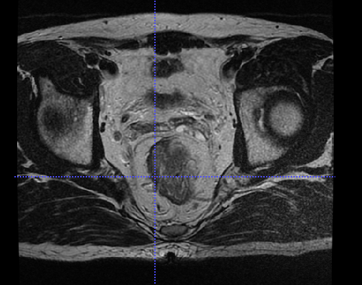
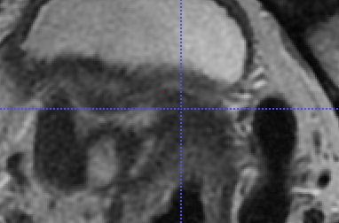

# 更新记录

## 16/5/2019

> by wu

以肿瘤为中心切割 slides,  步骤：

对于每张有肿瘤的 slides：

1. resize 到标准 spacing。（最小 384 x 384, 最大 615 x 615）

2. 记录肿瘤区域 `hw_min_max`，即 `h_min, h_max, w_min, w_max`，那么肿瘤中心点坐标为 

   `tumor_origin = ( (h_min + h_max) / 2, (w_min + w_max) / 2 )`

3. 以 `tumor_origin` 为中心，如果切割大小为 `(h_max - h_min) * (w_max - w_min)`，即只是切割肿瘤区域，那么这叫做 `mincut`，记为 `min_cut:`

4. 以 `tumor_origin` 为中心，如果切割大小为最大切割区域（不超过图片边界），叫做 `maxcut`

找出最小的 maxcut，最大的 mincut

最小的maxcut的高和宽是266x357

最大的mincut的高和宽是196x191

所以，切割的范围 max_mincut < cut < min_maxcut

选择cut = 224 x 224

下面这两张 slides 的肿瘤区域只有 1 个像素点：

<table>
    <tr>
        <td>
/home/share/Datasets/2019_rect_pcr_data/6_ROI/sub290/MRI/T2/IMG-0001-00020.dcm
</td>
    </tr>
    <tr>
        <td>
/home/share/Datasets/2019_rect_pcr_data/6_ROI/sub014/MRI/T2/IMG-0001-00016.dcm
</td>
    </tr>
</table>

## 16/5/2019

> by wu

0. 添加了 `settings.py` ，全局变量包括文件名、文件路径、log对象，都放在这里

1. 数据集的 loader 添加了 `num_workers=4`，加快速度

2. tensorboard 画混淆矩阵

   安装 `tbplot`

   `pip install tensorflow-plot`

## 10/5/2019

> add by peng
0. 添加了updates.md 记录每次更新；
1. 将load_dataset_v3改名为laod_dataset；
2. models库添加模型alexnet、densenet、inception、mobilenet、resnet、squeezenet、vggnet；
3. 尝试用pre-trained模型进行训练；
4. 为了使用预训练模型，将图片resize到224*224
5. 
